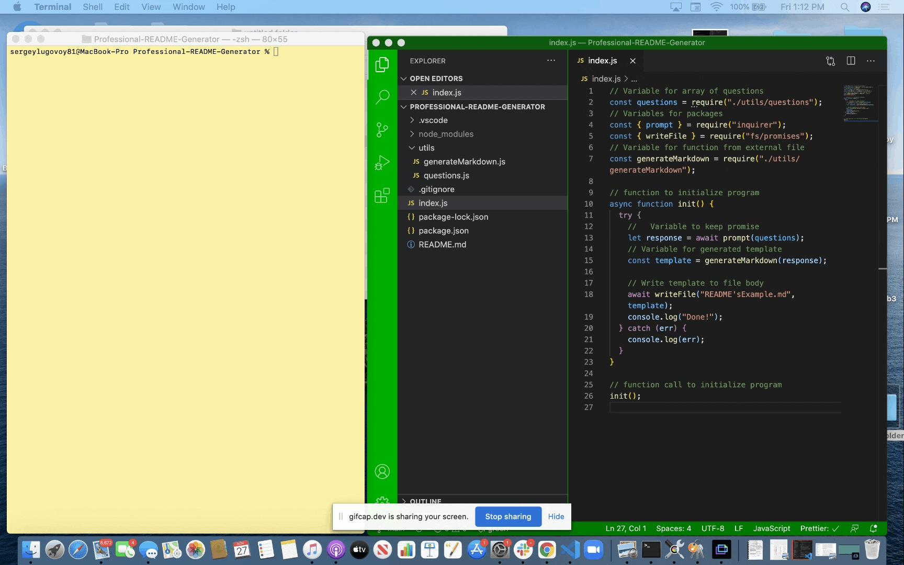

# Professional README Generator

When creating a project on GitHub, it is necessary to have a professional README for application. You need to explain what is the purpose of this app, how to install it, how to report issues, and how to make contributions.

You can easy create a README.md by using this application that based on command-line input and running with Node.js. Checkout the [README'sExample](./utils/README'sExample.md) in this repo that was created as an example.

## Table of Contents
* [Installation](#installation)
* [Usage](#usage)
* [Technologies](#technologies)
* [Contributing](#contributing)
* [License](#license)
* [Questions](#questions)


## Installation

To generate your own README, first run `npm install` to install the following npm package dependencies as specified in the `package.json`:

* `inquirer` that will prompt you for your inputs from the command line

The application itself can be invoked with following command

```
node index.js
```
## Usage

* Gif and instructions for use:



When you run `node index.js`, the app uses the `inquirer package` to ask you in the command line a questions about your project and your contact information, such as GitHub username and email address.

Than, application will generate markdown and a table of contents for the README based on your responses to the inquirer prompts. The README will also include badges for your GitHub repo.

And at the end, `writeFile` is used to generate yuor README.md with content according to your answers.

## Technologies

This application utilizes `promises`, `template literals`, `async/await`, `inquirer`, `node.js`.


## Contributing

When contributing to this repository, please first discuss the change you wish to make via issue, email, or any other method with the owners of this repository before making a change.

### Steps for contributing
1. Fork it!
2. Create your feature branch: `git checkout -b my-new-feature`
3. Commit your changes: `git commit -am 'Add some feature'`
4. Push to the branch: `git push origin my-new-feature`
5. Submit a pull request.


## License


## Questions

If you have any questions or concerns, feel free to contact me via:

GitHub: [slugovoy](https://github.com/slugovoy)

Email: serg.lugovoy.81@gmail.com


